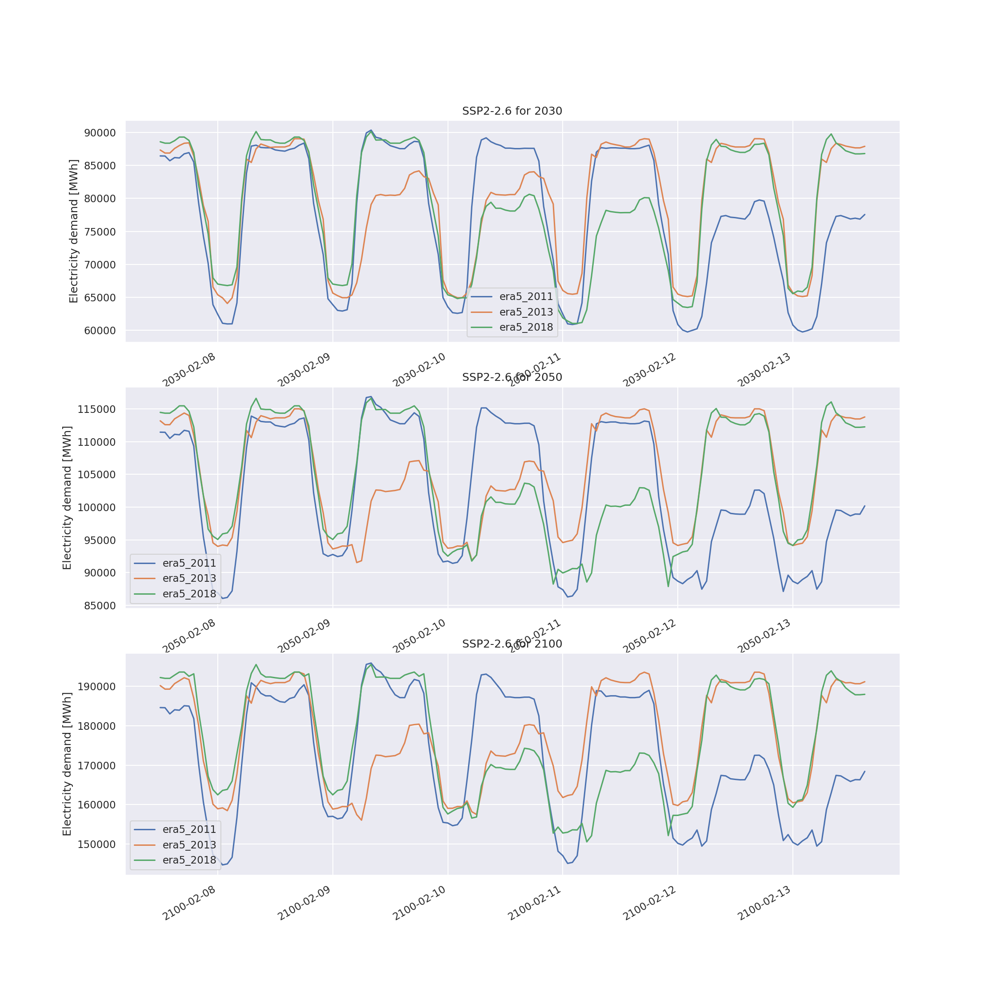
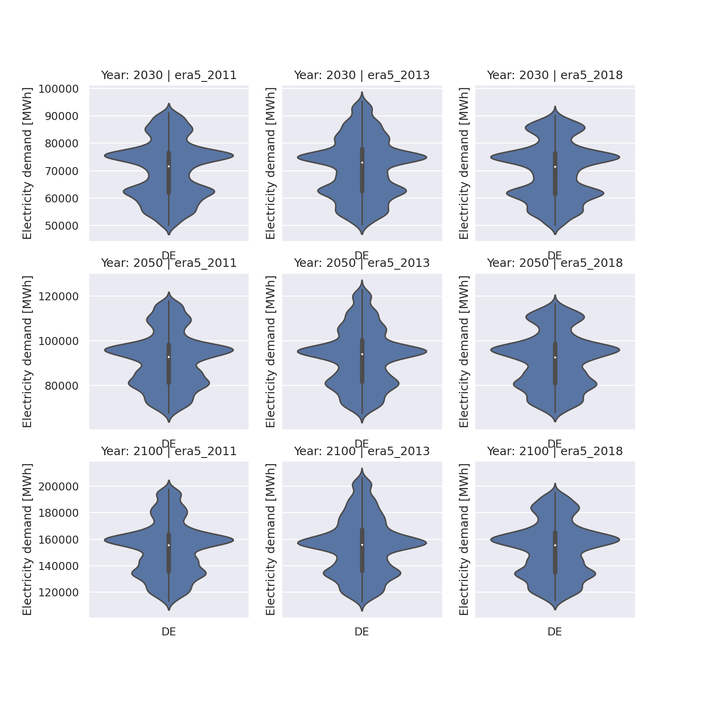
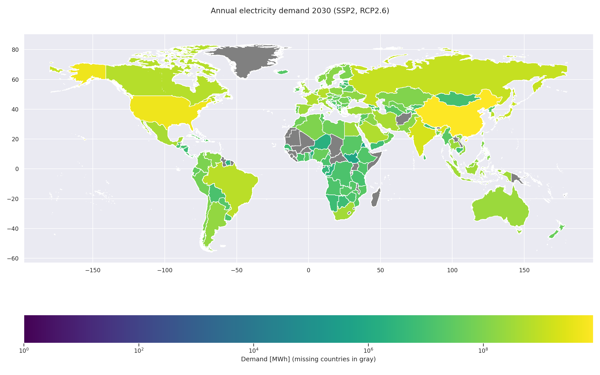

<!--
SPDX-FileCopyrightText: 2021 Johannes Hampp <johannes.hampp@zeu.jlug.de>

SPDX-License-Identifier: CC-BY-4.0
-->

## Installation

1. Install `julia` (version 1.6.2 or above was used for this workflow),
    see [instructions and download here](https://julialang.org/downloads/platform/).

> Important:  
> Make sure `julia` can be executed from the shell, e.g. add `julia` to your `PATH` environment
> as described in the documentation.

2. From within the `SynDe` project directory open a shell and startup `julia` with the project environment enabled:

    ```
    SynDe$ julia --project=workflow/envs/
    ```
    Open the package manager to check if the environment is activated
    and build the packages (may take some time)
    ```
    julia> ]
    
    (envs) pkg> status
        Status `~/share/GitHub/SynDe/workflow/envs/Project.toml`
    [31bfc850] GlobalEnergyGIS v0.1.0 `https://github.com/niclasmattsson/GlobalEnergyGIS#master`
    
    (envs) pkg> instantiate
    ```
3. Configure `GlobalEnergyGIS` (GEGIS) with user account data and work folder location
    ```
    julia> using GlobalEnergyGIS

    julia> saveconfig(string(pwd(),"/","resources/gegis"), <your CopernicusID>, "<your Copernicus API key>", agree_terms=true)
    ```
    For instruction what to enter for `<your ...>` see the [the first steps of the GEGIS documentation](https://github.com/niclasmattsson/GlobalEnergyGIS#2-create-config-files-and-agree-to-dataset-terms) on how to setup GEGIS.

## Region selection and definitions

The `snakemake` workflow describe below creates *regions*  for `GlobalEnergyGIS` to work on.
The regions are defined in [config/regions.yaml](./config/regions.yaml).
The definitions contain:

* The region name (e.g. Africa)
* The subregions associated with the region, with an entry for each region specifying
    * An uniquely identifying code (e.g. ISO 3166-2 two letter country code for countries)
    * The subregion name as recognised by GlobalEnergyGIS, i.e. as recognised by the [GADM database](https://gadm.org/maps.html) (version 2.8 / 2018)
* example entry for a region with one subregion:
    ```
    my_region:
        CH: Switzerland
    ```

> Note:
> Some subregions may not work as they break the GlobalEnergyGIS algorithm,
> which fails to determine population centers for very small or sparsely populated
> subregions. The following subregions are therefore missing from the definition
> and no synthetic demand is created for them:
>
> - "Antarctica"
> - "Bouvet Island"
> - "Heard Island and McDonald Islands"
> - "French Southern Territories"
> - "Saint Helena, Ascension and Tristan da Cunha""
> - "Cocos (Keeling) Islands"
> - "Christmas Island"
> - "British Indian Ocean Territory"
> - "Korea, Republic of"
> - "Lao People's Democratic Republic"
> - "Macao"
> - "Guernsey"
> - "Jersey"
> - "Monaco"
> - "Svalbard and Jan Mayen"
> - "Aruba"
> - "Anguilla"
> - "Saint-Barthélemy"
> - "Bermuda"
> - "Cayman Islands"
> - "Saint Kitts and Nevis"
> - "Saint Martin (French part)"
> - "Montserrat"
> - "Sint Maarten (Dutch part)"
> - "United States Minor Outlying Islands"
> - "Virgin Islands, British"
> - "Virgin Islands, U.S."
> - "American Samoa"
> - "Cook Islands"
> - "Micronesia, Federated States of"
> - "Marshall Islands"
> - "Norfolk Island"
> - "Niue"
> - "Nauru"
> - "Pitcairn"
> - "Tokelau"
> - "Tuvalu"
> - "Wallis and Futuna"
> - "South Georgia and the South Sandwich Islands"

## Caveats, Limitations, Manual interventions

* In the used version (2021-08-09) during the `download_datasets()` step,
    the protected land database (WDPA) did not download correctly, possibly due to a wrong URL.
    Changing the URL inside the `GlobalEnergyGIS` code to
    ```
    "WDPA"         ("WDPA (protected areas):", "WDPA.zip",
    "https://d1gam3xoknrgr2.cloudfront.net/current/WDOECM_Aug2021_Public_shp.zip")
    ```
    solved the issue.
* In the used version (2021-08-09) during the `download_datasets()` step,
    the extraction step of the WRI database did not work properly.
    The files were extracted but failed to be moved to the correct location,
    this was then done manually and the faulty step removed from the `GlobalEnergyGIS`,
    then the step was repeated.
* A fix to the timezone handling in GEGIS from this [GitHub PR](https://github.com/niclasmattsson/GlobalEnergyGIS/pull/14) was applied.
* The demand projection does not work for some countries, e.g. Mauritania.
  Affected countries are shown in grey in the world map example below.
* SSP4 and SSP5 are not available in GEGIS and thus this workflow.

## Example data

This workflow produces synthetic hourly resolved electricity demand under various scenarios.

Excerpt Germany hourly resolved electricity demand for different target years and ERA5 basis years for the SSP2-RCP2.6 scenario.


Statistical representation of German electricity demand for different target years and ERA5 basis years for the SSP2-RCP2.6 scenario.


Annual electricity demand by country for 2030 (ERA5 data for 2013) in the SSP2-RCP2.6 scenario:


## License

Copyright 2021 by Johannes Hampp .

This code is licensed under [MIT](LICENSES/MIT.txt).
The [Readme.md](Readme.md) file is licensed as [CC-BY-4.0](LICENSES/CC-BY-4.0.txt).
The configuration files are licensed [CC0-1.0](LICENSES/CC0-1.0.txt).